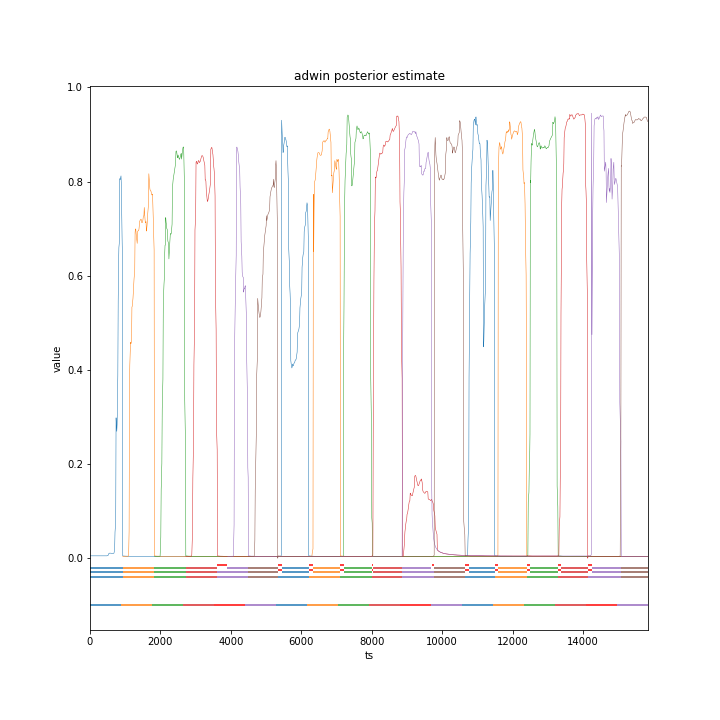

# SELeCT
Learning from streaming data requires handling changes in distribution, known as concept drift, in order to maintain performance. Adaptive learning approaches retain performance across concept drift by explicitly changing the classifier used to handle incoming observations, allowing changes in distribution to be tracked and adapted to.However, previous methods fail to select the optimal classifier in many common scenarios due to sparse evaluations of stored classifiers, leading to reduced performance. We propose a probabilistic framework, SELeCT, which is able to avoid these failure cases by continuously evaluating all stored classifiers.

The SELeCT framework uses a Bayesian approach to assign each classifier a probability of representing a similar distribution to incoming data, combining a prior probability based on the current state of the system with the likelihood of drawing recent observations. A continuous selection procedure based on the Hoeffding bound ensures that each observation is classified by the classifier trained on the most similar distribution. SELeCT achieves accuracies up to 7% higher than the standard framework, with  classifier use matching ground truth concept dynamics with over 90% recall and precision. 

This figure shows how the probabilities of each classifier change over time. Notice that recurring concepts trigger resurgences in the probability of the classifier used on the last occurence.

# Implementation

The SELeCT framework retains the representation of concepts as states, and the overall aim of selecting the optimal state to handle each observation, but reformulates drift detection and re-identification as a continuous, probabilistic selection procedure. SELeCT solves the issue of sparse evaluations of states by providing a full probability distribution for all states at every observation and guarantees that the selected state is the optimal achievable state.

For each state, SELeCT computes the probability that the state is optimal for the next observation using a Bayesian framework. A state prior based on current knowledge of the system is combined with a state likelihood based on recent observations. Drift detection is integrated into the prior probability component along with other sources of prior knowledge, such as the current active state. Re-identification is reformulated as calculating the likelihood of drawing recent observations from each state. These components, along with a continuous selection procedure, allow SELeCT to guarantee, within some error bound, that the selected state is the optimal achievable state under a given similarity measure.

## Instructions to Run
0. Using python 3.7, install requirements using `pip install -r requirements.txt`
- Install SELeCT module with `pip install -e .` run inside the SELeCT-master directory.
1. (Optional) Place desired datasets into the `RawData` directory. This is expected to contain `Real` and `Synthetic` subdirectories. These should each contain a directory for each data set to be tested on. The expected format for these is a `.csv` file for each ground truth context. The system will work with only a single `.csv` if context is unknown, but some evaluation measures will not be able to be calculated. For synthetic datasets created with a known generator, an empty directory in the `Synthetic` directory is needed to store files. Each dataset folder should be named the name you will use to call it. The base data directory should be passed as the `--datalocation` commandline argument. The dataset name is passed in the `--datasets` argument. New datasets will need to be added to the relevent list of allowed datasets in `run_experiment.py`, `synthetic_MI_datasets` for `Synthetic` datasets, or `real_drift_datasets` for `Real` datasets.
2. Run code for demos, discussed below.
3. Run main entry point, `run_experiment.py`. Set commandline arguments. Most are set to reasonable defaults. 
- Set seed using the `--seeds` command. This should be set to the number of runs if `--seedaction` is set to `new` (will create new random seeds) or `reuse` (will reuse previously used seeds). Or should be a list if `--seedaction` is `list`, e.g. `--seedaction list --seeds 1 2 3` will run 3 runs using seeds 1, 2 and 3.
- Set multiprocessing options. `--single` can be set to turn off multiprocessing for simpler output and ease of cancelation. Or `--cpus` can set the desired number of cpu cores to run on.
- Set meta-information functions and behaviour sources to disable using `--ifeatures` and `--isources`. For Quick runs, disabling `MI` and `IMF` can improve runtime significantly.
4. Results are placed in `~\output\expDefault\[dataset_name]` by default. This can be set with `--outputlocation` and `--experimentname`.
- The `results_run_....txt` file contains the calculated performance measures of the run.
- The `run_...csv` file contains measures describing how each observation was handled.
- The `run_...._options.txt` file contains the options used for a specific run.

### Running
The main evaluation entry point is `run_experiment.py`. This script runs SELeCT on a specified data set. 
`run_experiment_moa.py` runs the same experiment calling a moa classifier on the commandline. Used to test against baselines.

The `demo` directory gives an example of recreating results from the paper. To recreate the results on the CMC dataset:
1. Run the `demo\cmc_testbed.py` file. This will run `run_experiment.py` with the correct settings to recreate the results from the paper.
- The test by default runs on 45 seeds. To speed up the test using parallel processing, pass the commandline argument `--cpus X` where X is the number of CPU cores you wish to use.
2. The results of the test will print once done. The individual results for each seed can be found in `output\cmc_testbed\**`.
3. The `--dataset` commandline argument can be passed to run other tests. The other realworld datasets will need the appropriate dataset to be downloaded. Synthetic datasets can be run following the above instructions.

### Wind simulation demos
We also include a demo of SELeCT running on our air quality simulation. 
1. Run the `demo\windSimStream.py` file. A GUI should appear showing a view of the system over time.

